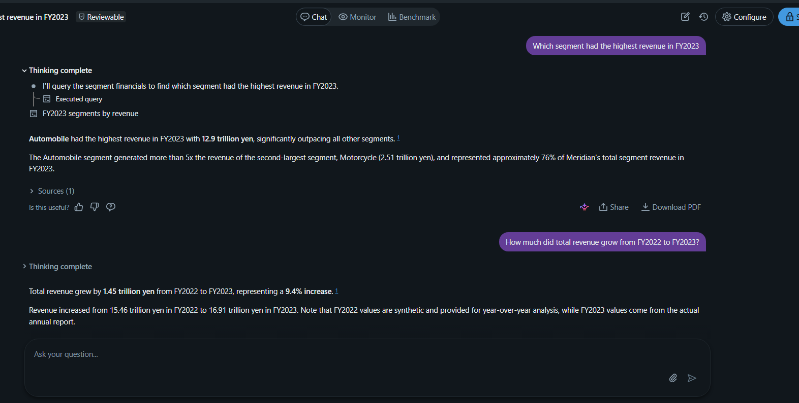
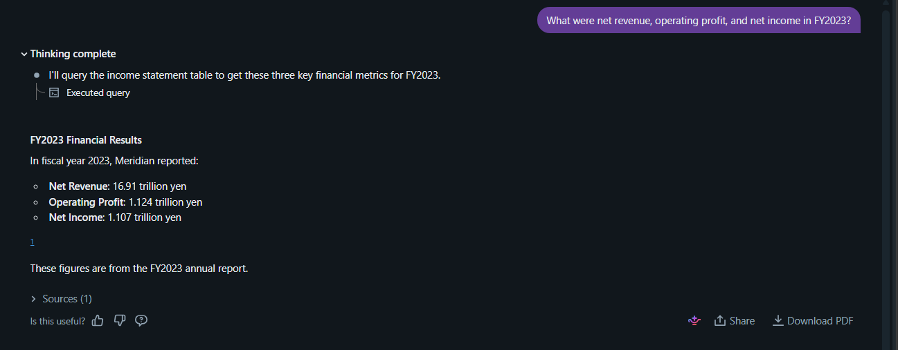

# CS4603 Extra Credit Assignment 1  
## Part 1 — Unity Catalog Functions as Governed Tools

**Student ID:** 27100380  
**Catalog:** `cs4603`  
**Schema:** `default`

---

## 1. Overview

I registered equivalent tools as Unity Catalog Functions and created an alternative graph implementation in `agent/graph_uc.py`.

The graph architecture remains:

```text
START
  → planner
  → supervisor
  → rag_agent OR uc_tools
  → supervisor
  → synthesizer
##   → END

I registered the following fxns on unity catalog: 
cs4603.default.growth_rate	: Calculate compound growth over a number of years

cs4603.default.percentage_change : Calculate percentage change between two values

cs4603.default.compare_values	: Compare two numerical values and report their difference

I created the following SQL function:
cs4603.default.to_billions

Verification query:

SELECT cs4603.default.to_billions(2400000000.0)
    AS amount_in_billions;

A SQL function is preferable when the computation can be expressed using relational or scalar SQL operations. SQL functions can execute close to the data, support query optimization and pushdown, and do not require starting a separate Python runtime.
evidence: sql function test result:

## 2. UC Function Testing

I registered and successfully tested `growth_rate`, `percentage_change`, and `compare_values` in `cs4603.default`, confirming that each returned the expected scalar result.


## 4. UC Graph Integration

I created `agent/graph_uc.py`, replacing the MCP calculation node with governed Unity Catalog tools while retaining the planner, supervisor, RAG agent, and synthesizer architecture.

## 5. End-to-End Test

The graph retrieved Meridian’s FY2023 revenue of ¥16,910 billion and used `growth_rate` to calculate a value of approximately ¥21,301.73 billion after three years of 8% growth.

## 6. Model Registration and Deployment

I logged an Agent Framework-compatible model and registered version 2 as `cs4603.default.s27100380_document_analyst_uc`. Endpoint deployment was attempted through `agents.deploy()`, but the SDK timed out while provisioning, so the registered model remains available for deployment.

## 7. Governed Delta Tables

I created two commented Unity Catalog Delta tables containing FY2022 and FY2023 segment and income-statement data. FY2023 values use the annual report, while FY2022 synthetic values are identified in `source_note`.

## 8. Genie Agent

I created the `s27100380 Meridian Financial Analyst` Genie Agent using both Delta tables, unit instructions, and two trusted SQL examples. I tested natural-language questions covering rankings, year-over-year growth, and income-statement metrics.

questions: Which segment had the highest revenue in FY2023?

How much did total revenue grow from FY2022 to FY2023?

What were net revenue, operating profit, and net income in FY2023?
## 9. UC Model Deployment

I successfully initiated deployment of model version 2 to `s27100380-document-analyst-uc`; the endpoint provisions asynchronously



